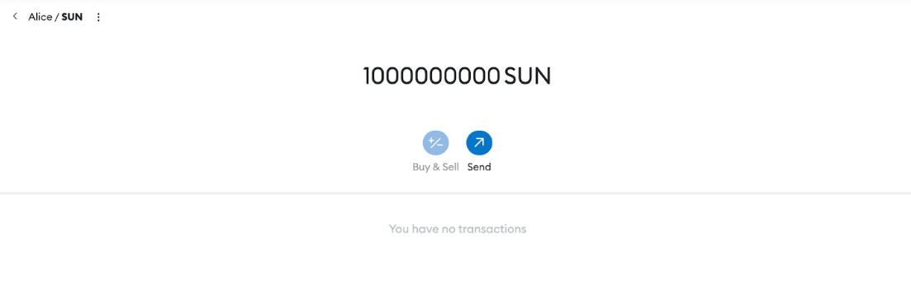
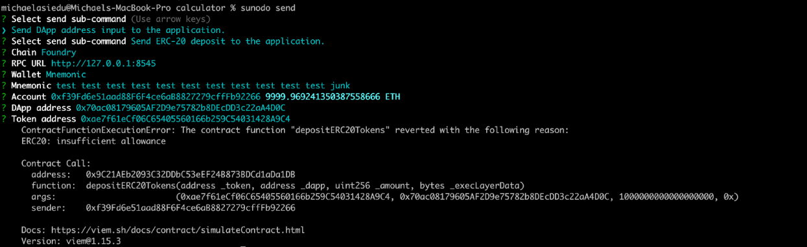

# Sunodo Troubleshooting

## Introduction

This comprehensive guide addresses various errors and issues that developers might encounter when using Sunodo. This section is organized into sections based on the nature of the problems, providing detailed explanations and solutions for each error.

## **Sunodo doctor**
### **Problem - Permission denied**
**Log**
````
user@user:~$ sunodo doctor
Error: Command failed with exit code 1: docker version --format {{json .client.Version}}
permission denied while trying to connect to the Docker daemon socket at unix:///var/run/docker.sock: Get "http://%2Fvar%2Frun%2Fdocker.sock/v1.24/version": dial unix /var/run/docker.sock: connect: permission denied "24.0.7"
````

**Solution**
Run as super user
````
sudo sunodo doctor
````

## **Sunodo build**

### **Problem - Error: Command failed with exit code 1: docker buildx build --load --iidfile**

**Log**
````
Error: Command failed with exit code 1: docker buildx build --load --iidfile /tmp/tmp-145018-xD0WXfb3XC7p
````
After running sunodo doctor:
````
Error: Unsupported Docker Compose version. Minimum required version is 2.21.0. Installed version is 2.19.1
````

**Solution**
Install sunodo according to the instructions on https://docs.sunodo.io/guide/introduction/installing#system-requirements

### Problem - **error getting credentials - err: exec: "docker-credential-desktop"**

**Log**
````
[+] Building 0.7s (2/2) FINISHED                                                                                     docker:default
 => [internal] load build definition from Dockerfile                                                                           0.0s
 => => transferring dockerfile: 1.02kB                                                                                         0.0s
 => ERROR resolve image config for docker.io/docker/dockerfile:1                                                               0.7s
------
 > resolve image config for docker.io/docker/dockerfile:1:
------
Dockerfile:1
--------------------
   1 | >>> # syntax=docker.io/docker/dockerfile:1
   2 |     FROM --platform=linux/riscv64 cartesi/python:3.10-slim-jammy
   3 |
--------------------
ERROR: failed to solve: error getting credentials - err: exec: "docker-credential-desktop": executable file not found in $PATH, out: ``
    Error: Command failed with exit code 1: docker buildx build --load --iidfile /tmp/tmp-33335-oSN293vSs5vj
    /home/charapyge/Developments/BlockchainProjects/Cartesi/my-app

````

**Solution**

If you have a credsStore line in your ~/.docker/config.json, remove it. Make a backup of the file first, just in case.

### Problem - Executor failed running
**Log**
````

user@user:~/yourfolder sunodo build
[+] Building 18.8s (10/14)																	docker:default
[internal] load build definition from Dockerfile									0.0s
=> => transferring dockerfile: 32B													0.0s
[internal] load.dockerignore														0.0s
=> transferring context: 2B															0.0s
=> resolve image config for docker.to/docker/dockerfile:1.4  						13.6s
=> CACHED docker-image://docker.to/docker/dockerfile:1.4@sha256:9ba7531bd80fb0a858632727cf7a112fbfd19b17e94c4e84ced81e24ef1a0dbc => [internal] load .dockerignore 														0.0s
[internal] load build definition from Dockerfile									0.0s
[internal] load metadata for docker.to/cartest/python:3.10-slim-jammy				1.4s

=> CACHED [1/6] FROM docker.io/cartesi/python:3.10-slim-jammy@sha256:a60d99fcd98d563e633bd06d28e2be94c7da45f335691edd9cbf3a0830694638 [internal] load build context
=> transferring context: 64B
=> ERROR [2/6] RUN <<EOF (apt-get update...)
> [2/6] RUN <<EOF (apt-get update...):
3.061 exec /bin/sh: exec format error
ERROR: failed to solve: executor failed running [/bin/sh -c apt-get update
apt-get install -y --no-install-recommends busybox-static=1:1.30.1-7ubuntu3 ca-certificates=20230311ubuntu0.22.04.1 curl=7.81.0-1ubuntu1.15 curl -fSSL https://github.com/cartesi/machine-emulator-tools/releases/download/v${MACHINE_EMULATOR_TOOLS_VERSION}/machine-emulator-tools-v${MACH
INE_EMULATOR_TOOLS_VERSION}.tar.gz \
tar -C / --overwrite -xvzf -
rm -rf /var/lib/apt/lists/*
]: exit code: 1
Error: Command failed with exit code 1: docker buildx build --load --iidfile /tmp/tmp-82599-9uin5MLWB0gx /home/marsifeanyi/<>/Cartesi-Ecosystem/my-app
````

**Solution**

Run the command as a super user.
````
sudo sunodo build
````

## Sunodo run

### Problem - **permission denied on .sunodo/image/hash**

**Log**
````
permission denied on .sunodo/image/hash
````

**Solution**
It's a known issue and it will be fixed in the next sunodo patch release.
For now, you can run
````
sudo chmod -R 777 .sunodo/
````

##  **Sunodo send**

### Problem - ERC-20 SunodoToken send ERC20 insufficient allowance(even with a balance of 1000000000 SUN)

**Log**



**Solution**

Sunodo has a test token deployed to the anvil sunodo runs. The first anvil account has ownership of an initial minted amount. Sunodo send does not call approve. There is an open issue (feature request, improvement) to track that. https://github.com/sunodo/sunodo/issues/200

You need to call approve on the portal to give him enough allowance to transfer ERC-20 tokens from your account

````
cast send [options...] $ERC20_TOKEN 'approve(address,uint256)' $ERC20_PORTAL $AMOUNT
````

where options... may include specifying a mnemonic, or a private key, etc. 
For example, if your local node is using the test test [...] test junk mnemonic, you can use Alice's secret key.
````
cast send --private-key $ALICE_SK $ERC20_TOKEN 'approve(address,uint256)' $ERC20_PORTAL $AMOUNT
````

where ALICE_SK has been previously assigned to the following value
````
0xac0974bec39a17e36ba4a6b4d238ff944bacb478cbed5efcae784d7bf4f2ff80
````

## General Problems

### 1 - Mac OS issue  running docker
**Solution**: Update docker

### 2 - Invalid image Architecture: amd64. Expected riscv64 
**Solution**: conflicting in ports / removing containers solved

### 3 - Manjaro Linux 
**Solution**: Update Nodejs version

### 4- Kernel panic error associated with the sunodo JS template
**Solution**: Unknown
*Workaround*: Host mode or Nonodo

### 5 - DepthTooHigh error

**Solution**: Write a `.sunodo.env.` and overwrite the variable `TX_DEFAULT_CONFIRMATIONS` to 1, as in:  `TX_DEFAULT_CONFIRMATIONS=1`. 
*Workaround*: try to free up some resources or use rollups-examples


## Manjaro OS

For detailed step-by-step instructions on the Manjaro OS, please follow the steps on https://hackmd.io/@Abims/S1S__iFdT.


